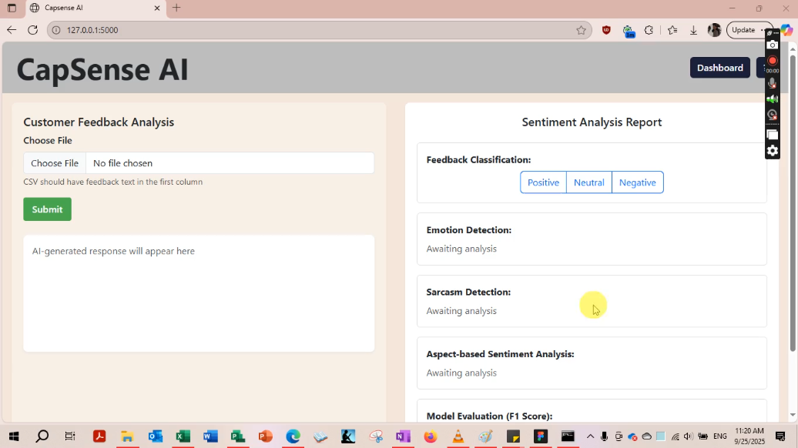

# CapSense AI – Sentiment Analysis and Response Generation Application

**Developed for Capgemini** – The sponsor of our technical work as a team of developers, testers, and technical writers using modern technologies.

---

## Overview

CapSense AI is an AI-powered Sentiment Analysis and Response Generation application designed to revolutionize customer service by analyzing customer feedback and generating empathetic, brand-aligned responses.

The system leverages machine learning for sentiment and emotion detection, sarcasm identification, and integrates advanced language models (Phi-3, later Phi-4) to generate personalized responses. It enables batch processing of feedback, providing actionable insights and automating routine tasks while maintaining a consistent brand voice.

This project showcases full-stack development capabilities, AI model integration, and practical experience in deploying enterprise-grade applications on Microsoft Azure.

---

**▶ Watch the demo of the sentiment analysis and response generation features**
[](https://drive.google.com/file/d/1hLhfb_w8bMp3_GzqWgtKudcqmytcW8Lk/view?usp=sharing)


## My Contributions

- **Frontend Development**  
  Built the responsive and interactive React frontend using Vite. Implemented:
  - Text input and CSV file upload for single and batch feedback.
  - Modular Sentiment Analysis Report UI with components for sentiment, emotion, sarcasm, aspect-based sentiment, and AI-generated responses.
  - State management, API integration with Axios, and conditional rendering to handle asynchronous backend responses.

- **Phi Model Integration**  
  - Initially integrated **Phi-3 Mini** model via Azure AI Studio for context-aware, empathetic response generation.  
  - Updated payload format from OpenAI-style requests to Phi-compatible requests.  
  - Later upgraded to **Phi-4**, ensuring seamless response generation and fallback mechanisms.

- **Emotion Detection Model**  
  - Built and trained a **Naïve Bayes classifier** from scratch using 42,000+ customer feedback entries.  
  - Achieved **55.81% accuracy** across six primary emotions (anger, joy, anticipation, neutral, disgust, sadness).  
  - Integrated the model into the Flask backend for real-time emotion classification.

- **Backend Integration & Deployment Support**  
  - Configured Flask APIs for batch and single-feedback processing.  
  - Assisted in deploying the backend on **Azure Virtual Machines**, ensuring proper environment setup, port configuration, and database connectivity.  
  - Helped debug server errors, install dependencies (e.g., NLTK), and ensure classifier functionality.

---

## Technologies Used

- **Frontend:** React, Vite, TypeScript, Bootstrap, Chart.js, Axios
- **Backend:** Python, Flask, Naïve Bayes (scikit-learn), NLTK, Hugging Face Transformers
- **AI Models:** Phi-3 Mini, Phi-4 (Azure AI Studio), custom-trained Naïve Bayes emotion classifier
- **Database:** Azure SQL, pyodbc
- **Deployment & Infrastructure:** Microsoft Azure App Service, Azure VM, Azure AI Studio
- **Other Tools:** GitHub, GitHub Actions (CI/CD), Putty, WinSCP

---

## Key Features

- Sentiment Classification: Positive, Negative, Neutral  
- Emotion Detection: Anger, Joy, Anticipation, Neutral, Disgust, Sadness  
- Sarcasm Detection  
- AI-Generated Empathetic Responses via Phi models  
- Aspect-Based Sentiment Analysis  
- Batch Processing of CSV Feedback Files  
- Interactive Dashboard with detailed analysis and visualization

---

## Installation & Usage

1. **Clone the repository**
```bash
git clone <repo-url>
cd capsense-ai
```

2. **Install backend dependencies**
```bash
pip install -r requirements.txt
```

3. **Install frontend dependencies**
```bash
cd frontend
npm install
```

4. **Set environment variables**
```bash
PHI3_KEY=<your-phi3-key>
PHI3_ENDPOINT=<your-phi3-endpoint>
```

5. **Run Backend**
```bash
python app.py
```

6. **Run Frontend**
```bash
npm run dev
```

7. **Access the application** via browser at `http://localhost:3000`

---

## Key Achievements

- Developed a complete **full-stack AI application** handling both frontend and backend integration.  
- Built a **custom Naïve Bayes emotion classifier** from scratch, achieving strong interpretability without relying on heavy transformers.  
- Integrated **Phi-3 and Phi-4 models** for dynamic, context-aware response generation.  
- Successfully deployed the system on **Azure Virtual Machines**, demonstrating cloud deployment and environment management skills.  
- Collaborated effectively with a team while resolving deployment and integration challenges.

---

## References

- Capgemini – Enterprise-grade sentiment analysis needs and branding requirements  
- Azure AI Studio Documentation – Phi Models  
- scikit-learn & NLTK – Machine learning and natural language processing  
- React & Vite – Frontend development framework and bundler

---

**CapSense AI** reflects hands-on experience in **full-stack development, machine learning, NLP, AI model integration, and cloud deployment**, making it a strong portfolio project for professional experience, including technical experience at **Capgemini**.


