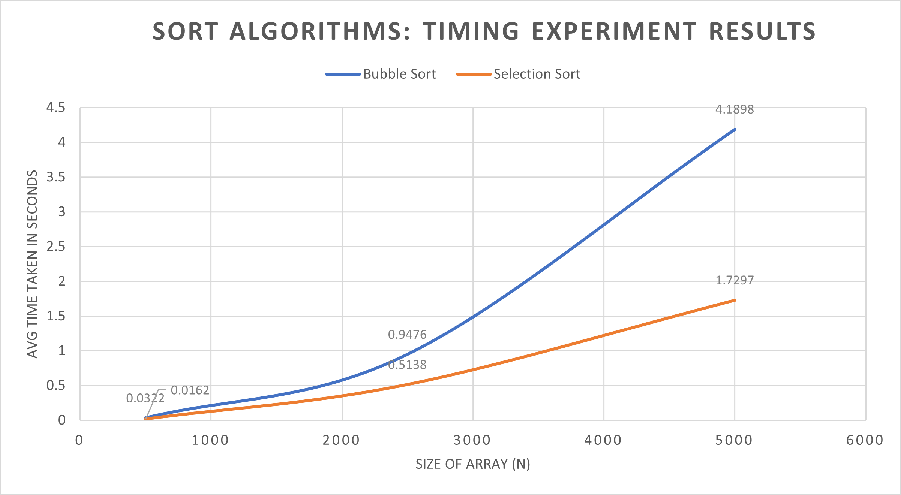

## Algorithm Timing Experiment: Bubble Sort vs Selection Sort

This project I did compares **Bubble Sort** and **Selection Sort** using both correctness checks and real-world timing experiments, completed for a Discrete Structures in Computing course.

### Project Goal

To evaluate how two O(n²) sorting algorithms behave in practice by measuring their average runtime across multiple input sizes and comparing the results to theoretical complexity analysis.

### Files Overview

* **BubbleSort.py**: Generates a random array, prints it before and after sorting, and verifies that the bubble sort algorithm works correctly.
* **SelectionSort.py**: Generates a random array, prints it before and after sorting, and verifies that the selection sort algorithm works correctly.
* **Part3BubbleSort.py**: Runs bubble sort on 1,000 randomly generated arrays of the same size and measures the total runtime to analyze average performance.
* **Part4SelectionSort.py**: Runs selection sort on 1,000 randomly generated arrays of the same size and measures the total runtime for performance comparison.

### Experiment Methodology

* The user inputs the array size `N`.
* For timing experiments, 1,000 different random arrays of size `N` are generated.
* Timing starts **after** array creation to measure only the sorting process.
* Total runtime is recorded and used to compute average sorting time.
* Experiments are repeated for multiple input sizes.

### Results and Analysis

Timing results were recorded in a spreadsheet and visualized using graphs.

* Timing results were recorded in a spreadsheet and visualized using graphs.
* Both algorithms exhibit O(n²) growth, but with different constant factors.
* Observed performance differences are discussed in the accompanying report.

### Included Artifacts

* Source code for all sorting and timing programs
* Spreadsheet containing timing results
* Graph comparing bubble sort and selection sort performance
* Written report explaining methodology, results, and conclusions

### Technologies Used

* Python
* Manual algorithm implementations (no built-in sort functions)
* Timing via `time.perf_counter()`

### Notes

This project focuses on algorithm analysis and experimental validation rather than production-level optimization.
